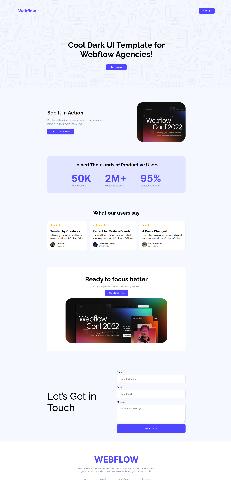

🌐 Webflow Landing Page

A modern and responsive landing page built with Webflow and exported as a static site.
Perfect for startups, agencies, or personal branding websites.

🚀 Live Demo

🔗 https://obaidullah-miazi-dev.github.io/webflow-landing-page/

📖 Overview

This landing page highlights:

A clean Light theme UI

Hero section with bold branding

User metrics (active users, sessions, satisfaction rate)

Trusted by brands (OpenAI, Google Ai Studio, Studio Vertex)

Testimonial section to build credibility

Contact form for user engagement

📂 Project Structure
webflow-landing-page/
│── index.html        # Main HTML file
│── styles/           # CSS stylesheets
│── assets/           # Images, icons, fonts

🛠️ Tech Stack

HTML5 – structure

CSS3 – styling

Webflow Export – design & layout

⚡ Getting Started

Clone the repository

git clone https://github.com/obaidullah-miazi-dev/webflow-landing-page.git

Open the project
Just open index.html in any browser.

Customize

Change text content in index.html

Replace images inside assets/

Update styling inside styles/

✨ Features

✔️ Fully responsive design
✔️ Clean and modern dark UI
✔️ Testimonials & trusted brands section
✔️ Contact form included
✔️ Easy to customize

📸 Preview

📜 License

This project is open source and available under the MIT License.

🔗 Connect with Me

GitHub:(https://github.com/obaidullah-miazi-dev)  

LinkedIn: (http://www.linkedin.com/in/obaidullah-miazi)  

Email: (obaidullahmiazi.dev@gmail.com)

